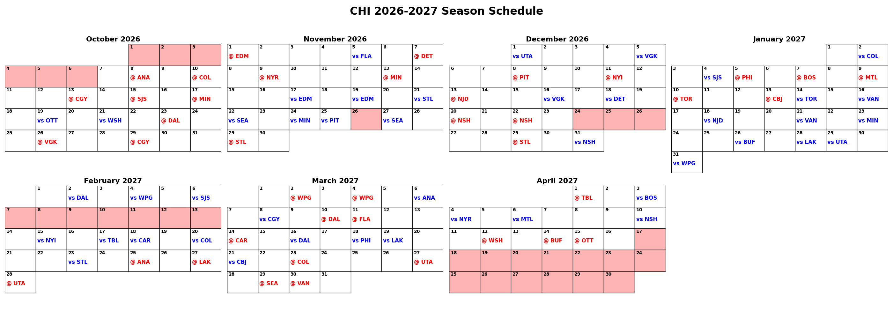

# NHL Schedule Genetic Algorithm

## Description
A genetic algorithm designed to generate optimized NHL regular season schedules under a variety of real-world constraints, including rest/game-day balance, home/away streak balance, and travel distance. This was my final project for an Evolutionary Computation course at StFX that I have continued to be developed since.

### Features
* **Chromosome Representation:** Encodes a full season schedule as a list of days, where each day holds the game IDs scheduled for it.
* **Multi-Objective Fitness Function:** Scores each team's schedule on rest/game-day balance, home/away streak balance, and total travel distance, calculated between arena coordinates using the Haversine formula.
* **Genetic Algorithm Core:** Uses tournament selection, order crossover, three mutation operators (game swap, day swap, day inversion), and elitism, with adaptive crossover/mutation rates and early stopping on fitness stagnation.
* **Hyperparameter Testing:** Reruns the algorithm across a range of values for tournament size, crossover rate, mutation rate, and elitism to compare their resulting best-fitness distributions.
* **Schedule Visualizations:** Generates best vs. average fitness plots, along with full calendar visualizations for the entire league and each individual team.

<p align="center">
  
  <br />
  <em>Example team schedule calendar (Anaheim Ducks), generated by the genetic algorithm.</em>
</p>


## Installation
### Prerequisites
* **Python 3.9+**

### Setup
1. **Clone the repository:**

```bash
git clone https://github.com/AveryJD/project-nhl-schedule-genetic-algorithm.git
cd project-nhl-schedule-genetic-algorithm
```

2. **Create a virtual environment:**

```bash
python -m venv venv
source venv/bin/activate  # On Windows: venv\\Scripts\\activate
```

3. **Install dependencies:**

```bash
pip install -r requirements.txt
```


## Usage
The typical workflow is:
1. Generate all possible game IDs
2. (Optional) Test different hyperparameter values
3. Run the genetic algorithm to find an optimized schedule
4. Generate visualizations of the resulting schedule


### Step 1: Generate Game IDs
This step generates every regular season game ID and the two teams playing in it, based on the NHL's divisional/conference schedule format for the 2026-2027 season (each team plays 84 games: 4 games against each division rival, 3 games against each same-conference team in another division, and 2 game against each team in the other conference).

Execute the following script from the project root:
```bash
python src/generate_game_ids.py
```

Generated game IDs will be saved to schedule_info/nhl_all_games.json.


### Step 2: Test Hyperparameters (Optional)
This step reruns the genetic algorithm many times across a range of values for each hyperparameter, to compare their effect on the best fitness found.

Open src/constants.py and adjust the values to test if desired:
```python
TEST_HYPERPARAMETERS = {
    'TOURNAMENT_SIZE':[2, 3, 4, 5],
    'CROSSOVER_RATE': [0.30, 0.40, 0.50, 0.60, 0.70],
    'MUTATION_RATE': [0.10, 0.20, 0.30, 0.40, 0.50, 0.60],
    'ELITISM': [True, False],
}
```

GA runs in this step are run in parallel across your available CPU cores, so testing multiple hyperparameters won't take as long as running everything sequentially would, but it may still take a while for all of the runs.

Execute the following script from the project root:
```bash
python src/hyperparameter_testing.py
```

This script will run the genetic algorithm STATISTICAL_RUNS times for each hyperparameter value and plot the resulting best-fitness distributions.

Generated distribution plots will be saved to the hyperparameters_results folder.

Note: This step can take a long time, since it reruns the full genetic algorithm many times over. I recomend reducing the GENERATIONS constant to a much lower value than what would be appropriate for the full algorithm run.


### Step 3: Run the Genetic Algorithm
This step runs the genetic algorithm to search for an optimized schedule.

Open src/constants.py and adjust the hyperparameters if desired:
```python
HYPERPARAMETERS = {
    'POPULATION_SIZE': 500,
    'GENERATIONS': 10_000,
    'STAGNANT_GENERATIONS': 1_000,
    'TOURNAMENT_SIZE': 3,
    'CROSSOVER_RATE': 0.40,
    'MUTATION_RATE': 0.40,
    'ELITISM': True,
}
```

Execute the following script from the project root:
```bash
python src/schedule_ga.py
```

This script will:
* Generate an initial population of randomized schedules
* Evolve the population using tournament selection, order crossover, mutation, and elitism
* Track the best and average fitness of every generation
* Stop once the generation limit is reached (set with the GENERATIONS constant), or once the best fitness stagnates for so many generations (set with the STAGNANT_GENERATIONS constant)

Results will be saved to the genetic_algorithm_results folder: the best schedule found (best_schedule.json), the fitness history (fitness_results.json), and each team's individual fitness score (team_fitnesses.json).

Note: Depending on the hyperparameters used, running the full genetic algorithm can take quite a while.


### Step 4: Generate Visualizations
Once a best schedule has been found, this step visualizes it.

Execute the following script from the project root:
```bash
python src/visualizations.py
```

This script will:
* Plot the best vs. average fitness per generation
* Generate a calendar visualization of the entire league's schedule
* Generate a calendar visualization of each individual team's schedule

Generated fitness plots will be saved to the genetic_algorithm_results folder, and calendar visualizations will be saved to the calendars folder.


## License
This project is licensed under the GNU General Public License v3.0. See the LICENSE file for details.


## Acknowledgments
* This project began as my final project for an Evolutionary Computation course at St. Francis Xavier University (StFX), and I've continued developing it since; it concluded with a 40-minute formal presentation. The [slides](https://analyticswithavery.com/static/assets/documents/nhl_schedule_ga_slideshow.pptx) used during the talk are also available, though they served as a visual aid and are not a full transcript of the presentation.
* Course instruction: Dr. James Hughes ([conlabx.com](https://conlabx.com)).


## Disclaimer
This project is for educational and analytical purposes and is not affiliated with the NHL.
